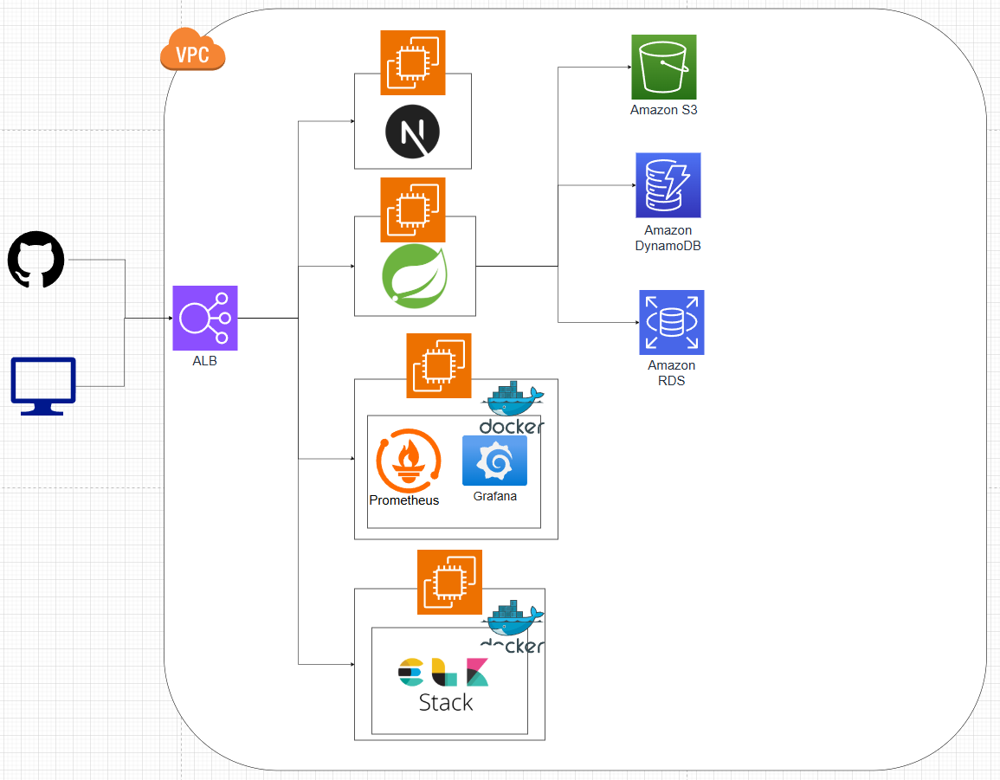

# 🏘️ ilsimdongne
> 동네 사람들과 함께 도전하고 소통하는 실시간 챌린지·커뮤니티 서비스

실시간 채팅과 인증 기반으로 챌린지 참여·관리·커뮤니티 상호작용을 연결합니다.

## ✨ 주요 기능
- 🎯 **챌린지 관리** - 생성·신청·멤버관리·인증 내역 조회
- 💬 **실시간 채팅** - 웹소켓 기반 대화/알림, 즉각적 피드백
- 📸 **인증 시스템** - 파일 업로드 및 이미지 최적화
- 🔐 **소셜 로그인** - Google/Naver/Kakao OIDC + JWT

## 🛠️ Tech Stack
### Backend

### Frontend

### Infra

## 🏗️ Architecture

## 👨‍👩‍👧‍👦 Team
<table align="center">
  <tbody>
    <tr>
      <td align="center"><a href="https://github.com/kyung186"> <b>kyung186</b></a> </td>
      <td align="center"><a href="https://github.com/minyeong-lee"> <b>minyeong-lee</b></a> </td>
      <td align="center"><a href="https://github.com/SeongriPark"> <b>SeongriPark</b></a> </td>
      <td align="center"><a href="https://github.com/kimyoungjun-dev"> <b>kimyoungjun-dev</b></a> </td>
      <td align="center"><a href="https://github.com/apfp77"> <b>apfp77</b></a> </td>
    </tr>
  </tbody>
</table>

## 🔗 Links
- **Backend**: [backend](https://github.com/ilsimdongne/backend)
- **Frontend**: [frontend](https://github.com/ilsimdongne/frontend)
- **발표자료**: [프로젝트 발표 PDF](./assets/project-overview.pdf)
